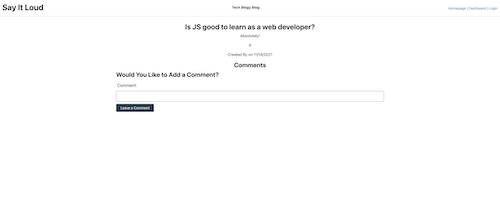

# TechBlog

Writing about tech can be just as important as making it. Developers spend plenty of time creating new applications and debugging existing codebases, but most developers also spend at least some of their time reading and writing about technical concepts, recent advancements, and new technologies.

# Criteria

```md
AS A developer who writes about tech
I WANT a CMS-style blog site
SO THAT I can publish articles, blog posts, and my thoughts and opinions
```
# Screenshot | Video





# Deployed Site

[Heroku Link](https://say-it-loud-blog.herokuapp.com/)

# Other Details

- Used classroom resources and activities to complete this assignment

- Worked with Todd Taylor, Brooke Jones, and Sam Kilpatrick


